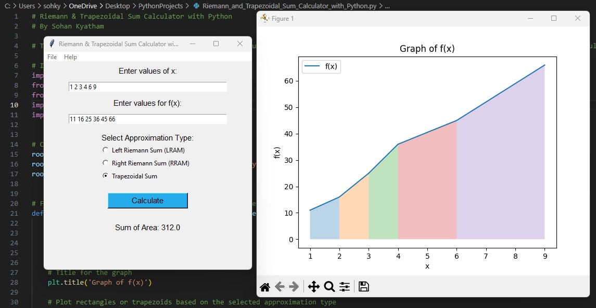

# Riemann-and-Trapezoidal-Sum-Calculator
## Description
Riemann sums and the trapezoidal rule are approximation techniques in integral calculus that approximate an integral by a finite sum. It divides the area under a curve into several subintervals and constructs rectangles or trapezoids to approximate the total area. The two Riemann sum methods used in this program are the LRAM (left-rectangular approximation method), which calculates the height of the rectangle using the left endpoint of each subinterval, and the RRAM (right-rectangular approximation method), which utilizes the right endpoint.  The trapezoidal rule, a refinement of the Riemann sum, utilizes trapezoids to approximate the area under the curve better. These methods allow the estimation of numbers, the computation of probabilities, and the analysis of complicated systems in practical situations by approximating the area under curves. Riemann and trapezoidal sums are utilized extensively in statistical analysis, computer graphics, and physics & engineering systems. This project aims to demonstrate these approximation techniques in integral calculus with Python, providing a simple and efficient way to approximate the area under a curve.



## Project Overview
This project's purpose is to allow users to utilize approximation techniques in integral calculus in Python to approximate the integral of a given function. The program provides a user-friendly interface where a user can input a set of data for the x and f(x) values and select the desired approximation method. The program then graphs the function based on the data values and allows the user to visualize the approximation process and obtain the sum of the area under the curve.

### Features:
The program includes an easy-to-use user interface where the user can enter the values of x and f(x) for a function and select their desired approximation type. The matplotlib library is utilized to visualize the function and it's integral. The data and graph can be cleared for new approximations and users can export the graph as an image file (png & jpg). Moreover, the application includes menubar functionality allowing the users to seamlessly clear their data & graph and export their graph from the menubar or by using intuitive keyboard shortcuts. The help menu bar provides information about the program and allows the user to view the project repository.

### Technologies Used: 
**__Python:__** The core programming language used for implementing the Riemann & Trapezoidal Sum Calculator. \
**__Tkinter Library:__** Python's standard GUI (Graphical User Interface) toolkit which was used to create the user interface for the application \
**__Matplotlib Library:__** A comprehensive library for creating static, animated, and interactive visualizations in Python. This library was used in the program for plotting the graph and the shapes for the integration methods. 

```
import tkinter as tk
from tkinter import messagebox
from tkinter import filedialog
import matplotlib.pyplot as plt
import webbrowser
```

### Implementation of the Riemann Sums and Trapezoidal Rule:
```
# Performs the calculation using the desired approximation type
def calculate_sum(x_values, fx_values):
    # Set the total_sum to 0, allows repeated sum calculations
    total_sum = 0

    # Get the approximation_type from the radio button that the user selected
    approximation_type = radio_var.get()

    # Left Riemann Sum
    if approximation_type == "left_riemann":
        for i in range(len(x_values) - 1):
            # Get the width/base value of rectangle, represents the width of each sub interval (delta x)
            width = (x_values[i + 1] - x_values[i])
            # Get the height of the left-most point of the rectangle
            height = fx_values[i]
            # Calculate the total sum of the areas of every rectangle
            total_sum += (width * height)

    # Right Riemann Sum
    elif approximation_type == "right_riemann":
        for i in range(len(x_values) - 1):
            # Get the width/base value of rectangle, represents the width of each sub interval (delta x)
            base = (x_values[i + 1] - x_values[i])
            # Get the height of the right-most point of the rectangle
            height = fx_values[i + 1]
            # Calculate the total sum of the areas of every rectangle
            total_sum += (base * height)

    # Trapezoidal Sum
    elif approximation_type == "trapezoidal_sum":
        # Area of trapezoid is 0.5 * (base1 + base2) * height
        for i in range(len(x_values) - 1):
            # Get the height of the trapezoid, this is the different of the width of each sub interval (delta x)
            height = (x_values[i + 1] - x_values[i])
            # Get the first and second base values of the trapezoid
            base_1 = fx_values[i] 
            base_2 = fx_values[i + 1] 
            # Calculate the total sum of the areas of every trapezoid
            total_sum += 0.5 * (base_1 + base_2) * height
    
    # Update the total_sum_label to display the sum of the area 
    total_sum_label.config(text="Sum of Area: " + str(total_sum))

    # Call the plot_sum_approximation to graph the points and then graph the shapes under the curve depicting area
    plot_sum_approximation(total_sum, x_values, fx_values, approximation_type)
```
